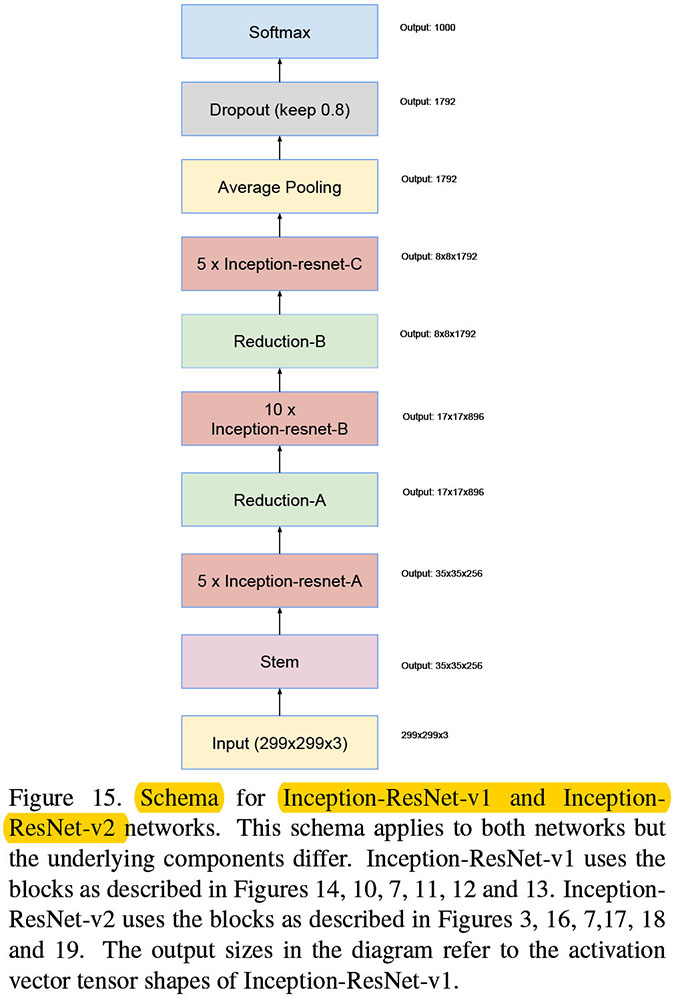
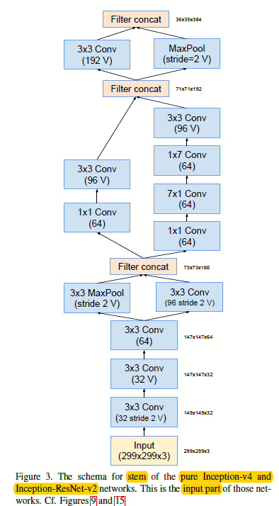
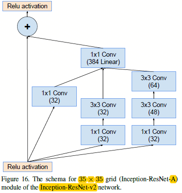
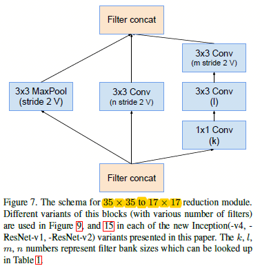
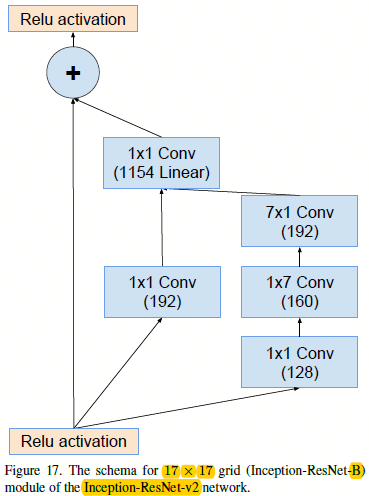
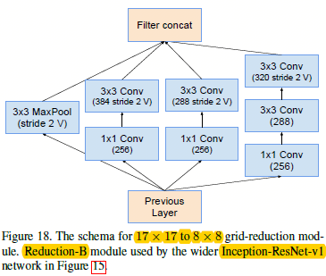
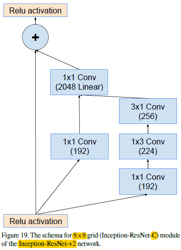

# Inception Resnet V2 结构
## 整体结构
 
Inception Resnet V2主要由1个stem，4个Inception A 模块，7个Inception B模块和3个Inception C模块组成。 
- Stem模块作为Inception Resnet V2的主干，起到提取基本特征的作用。
- Inception模块主要负责按尺寸提取特征。
- Reduction模块主要负责减小尺寸、加大深度。
## Stem模块

## Inception A 模块

## Reduction A 模块

## Inception B 模块

## Reduction B 模块

## Inception C 模块

